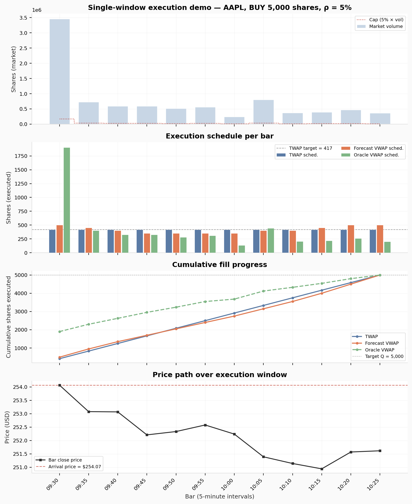
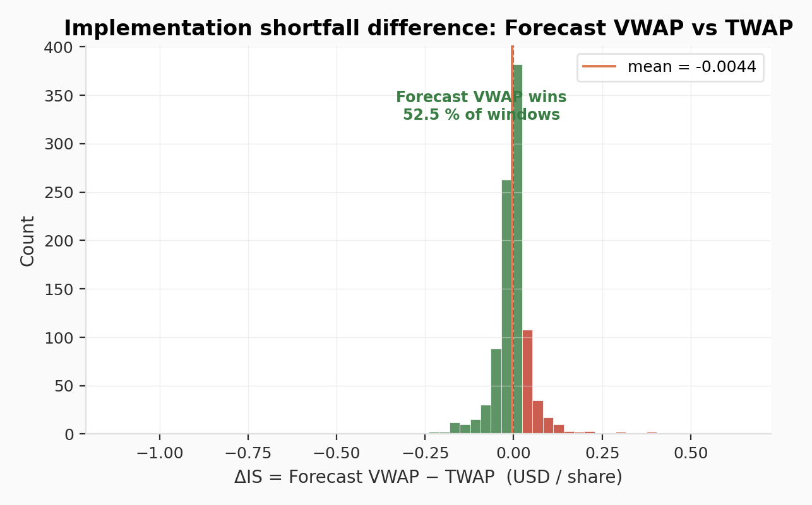
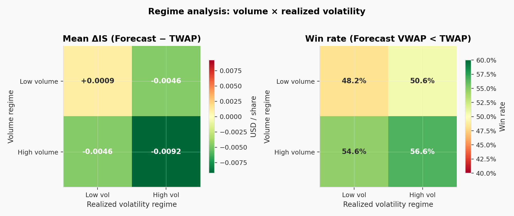
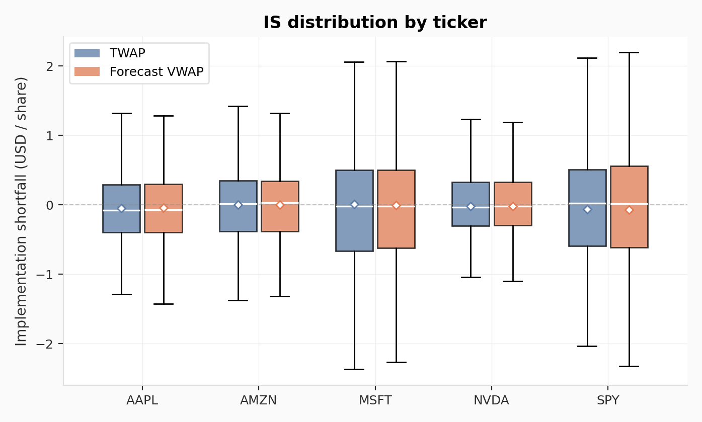

# Execution Cost Lab — TWAP vs VWAP on 5-Minute Bars

A reproducible simulation framework comparing **TWAP**, **forecast-profile VWAP**, and **realized-volume VWAP** (oracle) execution schedules on intraday equity data, under a **max-participation constraint**.

---

## Motivation

Institutional execution desks routinely split large orders over time to limit market impact. Two standard scheduling benchmarks are TWAP (uniform slicing) and VWAP (volume-weighted slicing). This project asks a simple but practically relevant question: **does a historical volume profile improve execution cost relative to a naïve TWAP, when measured by implementation shortfall vs. arrival price?**

The experiment is deliberately constrained — bar-level execution at close price, a hard participation cap, no reallocation — to isolate the scheduling effect and keep assumptions transparent.

---

## Key Results (1 000 windows, 5 tickers)

| Metric | TWAP | Forecast VWAP |
|:---|---:|---:|
| Mean IS (USD/share) | −0.0230 | −0.0274 |
| Mean fill ratio | 94.5 % | 93.7 % |
| Win rate vs TWAP | — | 52.5 % |

**Forecast VWAP reduces mean implementation shortfall by ≈ 0.0044 USD/share relative to TWAP.** The oracle (realized-volume) VWAP is reported in figures as an upper-bound reference that a real-time strategy cannot reach.

The advantage is concentrated in **high-volume regimes** (56.6 % win rate when both volume and volatility are high, 54.6 % in high volume / low volatility). It shrinks to 50.6 % in low-volume / high-volatility conditions and reverses marginally (48.2 %) in low-volume / low-volatility conditions, where the intraday profile contains little exploitable structure.

> Numbers above are from a full pipeline run (`bash run_all.sh`). A small sample CSV is bundled for plotting without internet access; run the pipeline to reproduce these exact figures.

### Figures

<p align="center">
  <br>
  <em>Single-window demo: bar-level execution schedule, cumulative fill, and price path.</em>
</p>

<p align="center">
  <br>
  <em>Distribution of ΔIS = Forecast VWAP − TWAP. Green = forecast wins.</em>
</p>

<p align="center">
  <br>
  <em>Regime analysis: forecast VWAP advantage by volume × volatility regime.</em>
</p>

<p align="center">
  <br>
  <em>IS distribution by ticker.</em>
</p>

---

## Model

### Execution schedules

Given a buy order of size $Q$ executed over $N = 12$ bars (60 min), with per-bar market volume $V_t$ and close price $P_t$:

**TWAP** — uniform target per bar:

$$q_t^{\text{TWAP}} = \min\left(\frac{Q}{N}, \ \rho \cdot V_t, \ Q - \sum_{s \lt t} q_s\right)$$

**Realized-volume VWAP (oracle)** — weights proportional to realized volume (in-sample):

$$w_t^{\text{real}} = \frac{V_t}{\sum_s V_s}, \quad q_t^{\text{real}} = \min\left(Q \cdot w_t^{\text{real}}, \ \rho \cdot V_t, \ Q - \sum_{s \lt t} q_s\right)$$

**Forecast-profile VWAP (ex-ante)** — weights from a historical intraday volume profile $\bar{\varphi}_t$:

$$w_t^{\text{fcst}} \propto \bar{\varphi}_{k+t}, \quad q_t^{\text{fcst}} = \min\left(Q \cdot w_t^{\text{fcst}}, \ \rho \cdot V_t, \ Q - \sum_{s \lt t} q_s\right)$$

### Metrics

- **Implementation shortfall**: $\text{IS} = \bar{P} - P_0$ (average execution price minus arrival price)
- **Fill ratio**: $\text{Fill} = Q^{\text{exec}} / Q$ (cap-induced underfill tracked separately)

Parameters: $\alpha = 0.03$ (order size as fraction of window volume), $\rho = 0.05$ (max participation), RNG seed = 42.

---

## Data

5-minute OHLCV bars for {AAPL, MSFT, AMZN, NVDA, SPY}, ~60 trading days via `yfinance`. Cleaned to NYSE regular trading hours (09:30–16:00 ET), deduplicated, zero-volume rows removed.

---

## Repository structure

```
src/
    __init__.py           # package exports
    download_data.py      # yfinance download -> data/raw/
    clean_data.py         # timezone + RTH filtering -> data/clean/
    execution.py          # TWAP / VWAP simulators + metrics
    run_experiment.py     # sample 1 000 windows, run strategies
    make_plots.py         # summary tables + figures -> results/
    run_one_window.py     # single-window visual demo
tests/
    conftest.py           # path setup
    test_execution.py     # unit tests on simulator invariants
    test_project_scripts.py
run_all.sh                # end-to-end pipeline
```

---

## Quickstart

```bash
python3 -m venv .venv && source .venv/bin/activate
pip install -r requirements.txt

# Run the full pipeline (download → clean → simulate → plot → demo)
bash run_all.sh

# Run the single-window demo on a different ticker
python3 -m src.run_one_window NVDA

# Run tests
pytest -q
```

> **Note:** the download step requires internet access (Yahoo Finance via `yfinance`).

---

## Design choices & limitations

- **Bar-level execution proxy** — trades priced at bar close; no intra-bar price path or limit-order modeling.
- **No market impact model** — the participation cap is the only impact proxy. Adding Almgren–Chriss temporary/permanent impact would be a natural extension.
- **No catch-up logic** — if the cap prevents filling a bar target, the shortfall is not reallocated to later bars. This is intentional: it isolates the schedule quality from reallocation heuristics.
- **IS on executed shares only** — unfilled quantity is tracked via fill ratio, not penalized in IS. This avoids conflating schedule quality with cap-driven underfill.

---

## Possible extensions

- Add a simple **Almgren–Chriss impact model** and compare optimal-IS schedules.
- Replace the historical average profile with a **rolling/exponentially-weighted volume forecast**.
- Add **intraday volume-of-volume** (volume CV) as a conditioning variable for schedule selection.
- Implement a **POV (Percentage of Volume)** strategy as a third benchmark.
